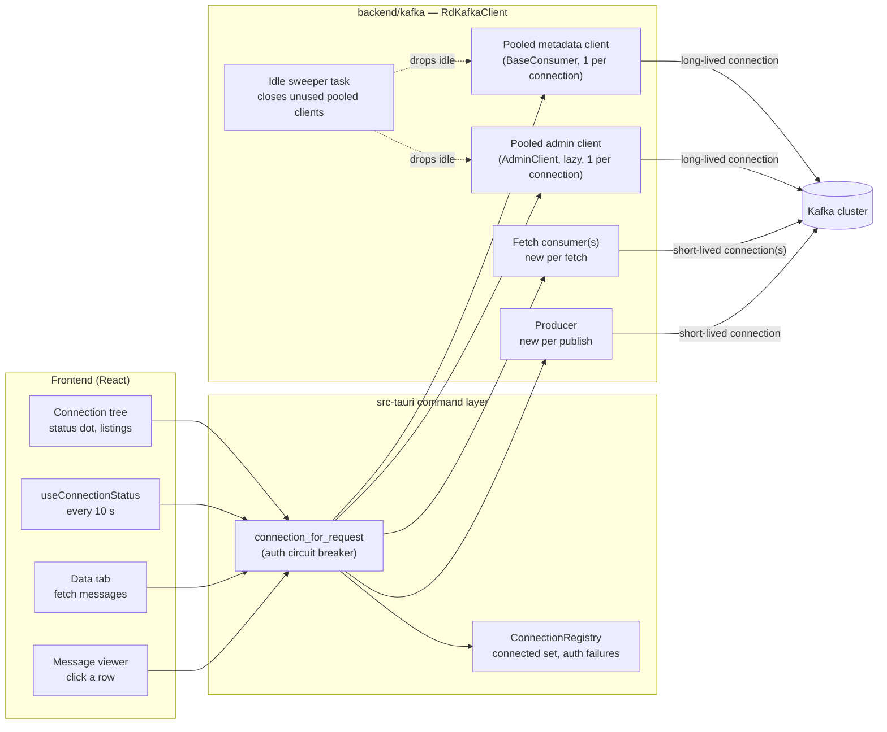
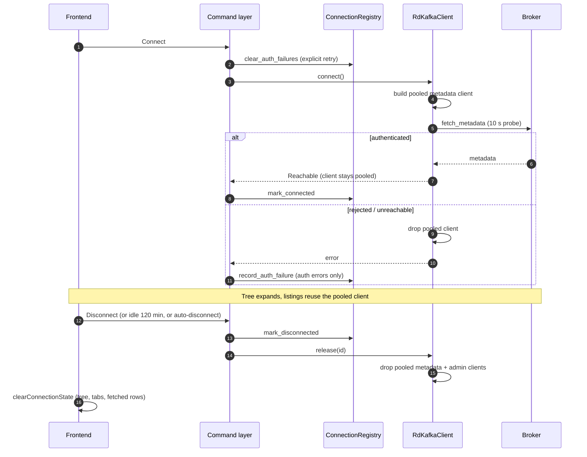
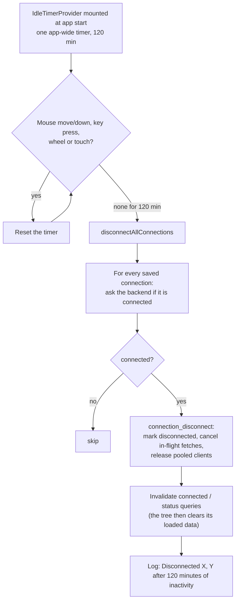
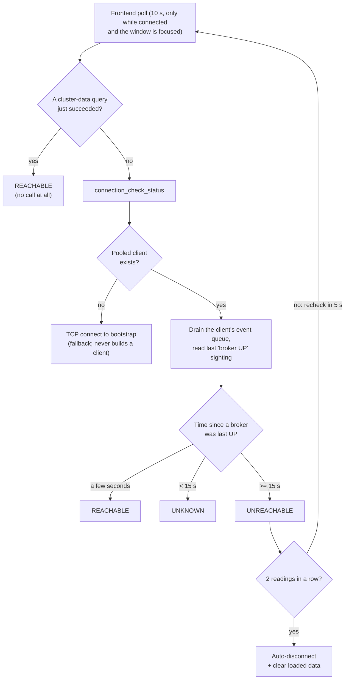
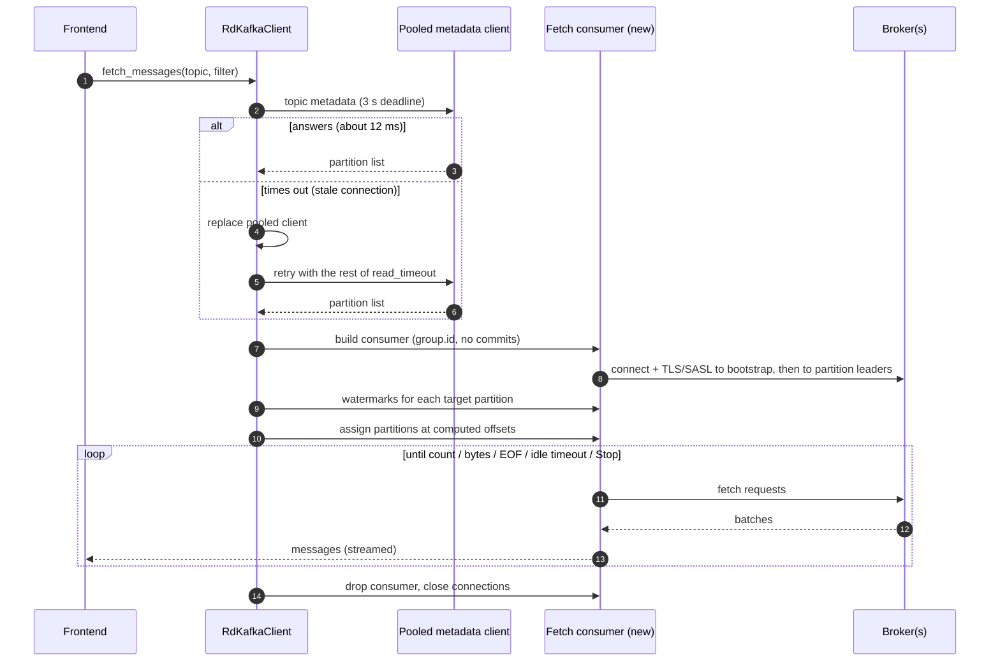

# Connections and Kafka clients — architecture

How Salty talks to a Kafka cluster: which clients exist, when they are created
and closed, how the status dot is computed, how a message fetch differs from
everything else, and the failure cases that shaped the design.

Everything here is about `backend/kafka` (`client.rs`, `config.rs`), the
connection registry in `backend/core`, the command layer in
`src-tauri/src/commands/`, and the polling hooks in
`frontend/src/features/connections/`. File and constant names are given so the
claims can be checked.

Diagrams are Mermaid; GitHub and most editors render them.

**Verification status.** Behaviour marked *measured* was observed against a real
broker (local Docker brokers, plus a TCP proxy that silently drops idle flows).
Anything marked *not verified* is read from code or reasoned, not run.
`src-tauri` cannot be built in the development environment used for this work,
so the command layer is described from reading it, not from running it.

---

## 1. The big picture

Two kinds of client, and the difference drives most of the design:

* **Pooled** (metadata, admin): built once, kept, reused by many requests. One
  connection per broker actually used (`enable.sparse.connections=true`).
* **Per-request** (fetch consumer, producer): built for one operation and
  thrown away. Each opens its own connection(s) and pays a fresh handshake
  (TCP, plus TLS and SASL on a secured cluster).

HTTP-only integrations (Schema Registry, ksqlDB) do not use Kafka clients and
are out of scope here.

---

## 2. Client inventory

| Client | Type | Created | Closed | Used for |
|---|---|---|---|---|
| **Pooled metadata** | `BaseConsumer` (no `group.id`) | Connect, or the first request that needs it | Disconnect, connection edit, auth failure, 5 min unused, app exit | Connect probe, brokers, topics, consumer groups, partitions, message count, group lag, a fetch's topic metadata, **the status check** |
| **Pooled admin** | `AdminClient` | First use of Config tab / ACLs / version detection | Same triggers; expires on its own clock | `DescribeConfigs`, ACLs (via raw FFI in `acl.rs`) |
| **Fetch consumer** | `BaseConsumer` with `group.id`, no commits | Every fetch | End of that fetch | Reading messages. A wide fetch builds several (shards) |
| **Producer** | `FutureProducer` | Every publish call | End of the call | Publishing |

The pooled metadata client is built from `client_config(connection)` plus
`statistics.interval.ms=5000`. Statistics are set **only** here, because they
are what the status dot reads.

Shared client configuration (`config.rs`):

* `client.id = salty/<app version>` — so operators can attribute and throttle
  this app's traffic.
* `reconnect.backoff.ms=1000`, `reconnect.backoff.max.ms=30000`,
  `socket.connection.setup.timeout.ms=5000` — caps how hard one client hammers a
  broker that rejects it.
* `enable.sparse.connections=true`, `allow.auto.create.topics=false` — a
  read-only browsing tool must not open a connection per broker or create a
  topic because someone clicked a stale row.

---

## 3. Connection lifecycle

Ways a session ends, all of which converge on `release()` plus the frontend's
`clearConnectionState`:

1. The user clicks **Disconnect**.
2. The **120-minute idle timeout** (see "Idle timeout" below).
3. The **auth circuit breaker** trips (see §7).
4. **Auto-disconnect on unreachable** (see §4): two consecutive `UNREACHABLE`
   status readings.
5. **Delete** or **edit** of the connection. An edit releases the client but
   leaves the cluster marked connected; the next request rebuilds it with the
   new settings. Several things rely on that lazy rebuild (see §8).

### Idle timeout (120 minutes)

A fixed, non-configurable policy that ends every session after two hours of the
user doing nothing. It lives entirely in the frontend
(`frontend/src/features/idle/`) and reuses the normal Disconnect path.

Details that are easy to get wrong:

* **One timer for the whole app, not one per cluster.** Activity anywhere in the
  window keeps every connection alive, and when the timer fires it disconnects
  all connected clusters together (in parallel).
* **What counts as activity:** `mousemove`, `mousedown`, `keydown`, `wheel` and
  `touchstart` on the window. **Background work does not count.** The status
  poll, auto-refreshes and an in-flight fetch do not reset the timer, so a
  fetch left running and unattended is cancelled when the timer fires.
* **It asks the backend, not React Query's cache** whether each connection is
  connected, because the cached value can be stale after the user has been away.
* **Result is identical to clicking Disconnect:** the registry marks the
  connection disconnected, the pooled metadata and admin clients are released
  (their broker connections close), and `clearConnectionState` empties the tree,
  panes, fetched rows and open payload. Reconnecting is a manual **Connect**.
* **It is a backstop, not the main cleanup.** Unused pooled clients are closed
  after 5 minutes by the idle sweeper (§6A) and a dead cluster is disconnected
  within about 20 seconds (§4). The 120-minute timer is what ends a session
  that is *alive and polled* but that nobody is using: while the window stays
  focused, the status poll touches the pooled client every 10 seconds, so the
  sweeper never closes it, and without this timeout an abandoned but focused
  window would hold its connection open indefinitely. (An unfocused window stops
  polling, so there the 5-minute sweeper closes the client first.)
* **Do not confuse it with the 5-minute client expiry.** That one is per pooled
  client, in the backend, driven by *requests and status polls*. This one is
  app-wide, in the frontend, driven by *human input*.
* **Not verified:** how the timer behaves across machine sleep. It is an
  ordinary `setTimeout` in the webview, so a long sleep may delay it rather than
  fire it on schedule; that was not tested.

---

## 4. The status dot

The dot used to mean "a TCP connect to the bootstrap port succeeded", sent every
10 seconds. For a connected cluster it now reads the pooled client's own account
of its connections and sends the broker nothing.

**Why a duration, not a single reading.** *Measured:* when a broker closes an
idle connection (`connections.max.idle.ms`), librdkafka reports
`AllBrokersDown` and the broker state drops to `INIT`, then reconnects by itself
in about 2–3 seconds. A dead broker looks identical for those first seconds, and
then never comes back. Only the length of the gap separates them, so
"no broker UP for 15 s" is the unreachable verdict and anything shorter is
`UNKNOWN`, which never counts as a strike.

Inputs to the verdict (`salty_core::LivenessTracker`):

* librdkafka **statistics**, every 5 s, delivered only while the client's queue
  is served — `liveness_status` serves it (bounded drain) on each check. The
  report's own timestamp is used, so a backlog drained in one go cannot make an
  old sighting look fresh.
* Any **successful pooled request** counts as a broker-UP sighting.

Measured end to end (broker stopped, then restarted): `REACHABLE` → `UNKNOWN`
for about 9 s → `UNREACHABLE` about 15 s after the broker died → back to
`REACHABLE` after the restart. **Recovery can be slow:** in one run it took
about 45 s, from librdkafka's reconnect backoff (up to 30 s) plus the broker's
own startup. Disconnect and Connect work regardless.

Frontend details (`connectionStatusPolling.ts`, `useConnections.ts`):

* Steady poll 10 s (`REACHABILITY_POLL_MS`); after an `UNREACHABLE` result,
  recheck after 5 s (`UNREACHABLE_RECHECK_MS`).
* Skipped entirely when a cluster-data query (topics, brokers, partitions, …)
  succeeded within the poll window and nothing failed since — real traffic is
  proof of life. Never skipped while the last result was `UNREACHABLE`.
* A **failed** cluster-data query triggers an immediate probe instead of
  waiting for the next tick.
* Polling pauses when the window loses focus (`focusManager` is wired to
  Tauri's real focus event in `App.tsx`).

---

## 5. Message fetch — why it opens its own connection

A wide or compressed fetch may build several consumers (shards), each polled
from one loop, to spread decompression across threads (`fetch_shard_count`).

### Why not reuse the pooled connection for fetches

* *Measured, 20 single-row fetches against a real broker:* about 104 ms each
  building a fresh consumer, about 346 ms each reusing one. Parking a consumer
  between fetches means unassigning and reassigning partitions, and that costs
  more inside librdkafka than building a new consumer.
* A fetch consumer needs a `group.id` (rdkafka routes `assign()` through the
  group machinery; without one it fails with "Local: Unknown group"). That
  starts a **group-coordinator query** which queues ahead of any metadata
  request on the same client. The pooled metadata client has no `group.id`, so
  it has no such queue — which is also why the fetch asks *it* for the partition
  list (about 12 ms) instead of its own consumer (about 500 ms).
* Fetches are concurrent and individually cancellable, each with its own byte
  budget and idle timeout. Sharing a consumer would couple them.
* A stuck or failed fetch cannot damage the pooled client the tree and the
  status dot depend on.

**The cost, and what is not verified.** Every fetch pays a fresh connection and,
on a secured cluster, a TLS/SASL handshake that shows up in broker
connection/auth logs. The 104 ms vs 346 ms figure came from a single recorded
test setup (whether it was plaintext or local is not recorded). On a
high-latency TLS cluster the handshake could outweigh the reassign cost; that
has **not** been measured. If fetch connection churn matters, measure a pooled
fetch consumer against a TLS/SASL broker before changing anything.

---

## 6. Keeping pooled clients healthy

Three mechanisms, each added for a specific failure that was reproduced.

```mermaid
flowchart TD
    subgraph Expire["A. Idle expiry"]
        E1["Each pooled client stamped with last_used_ms<br/>(a request or a status poll counts)"] --> E2["Sweeper task every 30 s"]
        E2 --> E3{"unused >= 5 min?"}
        E3 -- yes --> E4["Close it (outside the pool lock)"]
        E3 -- no --> E5[keep]
    end
    subgraph Stale["B. Dead-connection detection"]
        S1["Request arrives"] --> S2{"Which kind?"}
        S2 -- "fetch (tiny metadata call)" --> S3["Ask with 3 s deadline"]
        S2 -- "listing (can be slow)" --> S4{"No answered request<br/>for >= 20 s?"}
        S4 -- yes --> S5["Probe: 1-topic metadata, 3 s"]
        S4 -- no --> S6[use client]
        S3 --> S7{"Timed out?"}
        S5 --> S7
        S7 -- yes --> S8["Replace client, retry once<br/>with the rest of read_timeout"]
        S7 -- no --> S6
    end
    subgraph Auth["C. Auth breaker"]
        A1["Authentication error"] --> A2["release() + record_auth_failure"]
        A2 --> A3{"2nd rejection?"}
        A3 -- yes --> A4["Blocked: no client is built,<br/>nothing dials the broker"]
    end
```

### A. Idle expiry (`IDLE_CLIENT_TTL` = 5 min, `IDLE_SWEEP_INTERVAL` = 30 s)

*Why it exists.* Nothing in the backend checks `is_connected` before building a
client, so a late request after Disconnect silently recreates one.
librdkafka has no "give up on bad credentials" setting: a pooled client whose
credentials are rejected re-dials forever. *Measured on a SASL broker:* failed
logins at 0, 2, 11 and 37 s, then about every 30 s — roughly 2,900 a day for as
long as the client lives. With expiry, retries stopped once the client closed.

* A connected cluster is polled every 10 s, so its client is never reaped.
* A hidden window stops polling, so its client closes after 5 min and rebuilds
  lazily on return. The status dot falls back to the TCP check for that stretch.
* The task holds only `Weak` references to the pools; it ends with the client.

### B. Dead-connection detection (`STALE_PROBE_TIMEOUT` = 3 s, `STALE_IDLE_AFTER` = 20 s)

*Why it exists.* A NAT, load balancer or firewall can forget an idle flow without
telling either end. The pooled client still believes it is connected and a
request waits out the whole read timeout. *Reproduced* with a proxy that goes
silent on a flow after 60 idle seconds:

| After ~2 min idle | Before the fix | After |
|---|---|---|
| Click a message (fetch) | 15.4 s, fails; fails again on retry | 3.8 s, succeeds; next click 12 ms |
| Each listing (brokers, topics, groups, partitions, count) | 15.3 s, fails; fails again | 3.8 s, succeeds; next 1–4 ms |

* The fetch's own topic-metadata call is the probe (always tiny).
* Listings cannot be their own probe — all topics on a big cluster can honestly
  take longer than 3 s — so a client idle for 20 s gets a one-topic metadata
  request first (`LIVENESS_PROBE_TOPIC`; unknown-topic is a perfectly good answer).
* The idle clock (`last_success_ms`) counts **only completed requests**.
  Deliberately not the status poll and not statistics: a connection a NAT has
  dropped still looks `UP` in every statistics report.
* Only a **timeout** replaces the client. A rejected credential or a missing
  topic means the cluster answered; a fresh client would be told the same.
* The retry gets the remainder of the same budget, so a cluster that is really
  down is reported no later than before.

### C. Authentication circuit breaker (`MAX_AUTH_ATTEMPTS` = 2)

* Two consecutive authentication rejections block the connection: every further
  automatic request is refused from memory, no client built, no socket opened.
* Only an explicit **Connect/Reconnect** click or an **edit** clears it. So each
  click gets a fresh allowance of two.
* Only `AppError::Authentication` counts. A timeout or transport failure stays
  retryable; `AppError::Authorization` (e.g. `TOPIC_AUTHORIZATION_FAILED`) is
  deliberately not authentication, so one refused publish cannot take a working
  cluster offline.
* *Measured:* one Connect click with a wrong password cost the broker 2 failed
  handshakes (about 2.7 s apart) inside the 10 s probe. So the worst case is
  about 4 handshakes before the breaker blocks, and each further click costs
  about 2 more.

---

## 7. Multiple brokers

* `bootstrap.servers` may list several brokers. The client connects to one,
  fetches cluster metadata, and then connects (sparsely) only to brokers it
  actually needs.
* **Liveness is "any broker up".** One broker down does not make the cluster
  `UNREACHABLE`; the verdict needs *no* broker up for 15 s, then two readings.
* The TCP fallback pings the first bootstrap entry at once and the rest after a
  250 ms stagger, and is `Reachable` as soon as any accepts — so a dead first
  entry no longer delays the answer by a full timeout.
* Fetches go to partition leaders, so a partition whose leader is down fails or
  times out for that partition.
* *Not verified:* all the liveness and failure measurements in this document came
  from single-broker setups. Multi-broker failover behaviour is read from the
  code and librdkafka's documented behaviour, not run. In particular, how long
  the status reads `UNKNOWN` while the pooled client moves from a dead broker to
  a live one has not been measured.

---

## 8. Nuances and gotchas

| Nuance | Detail |
|---|---|
| **Two different "idle" timers** | 5 min per pooled client (backend, counts requests and status polls) vs 120 min app-wide (frontend, counts only human input and disconnects every connected cluster). A polled, connected cluster is never closed by the first, only by the second. |
| **Pooled client is rebuilt lazily after an edit** | `connection_update` releases the client but leaves the cluster registered as connected. Until the next request rebuilds it, the status check has no pooled client and falls back to a TCP connect every 10 s. |
| **No request path checks `is_connected`** | Only the frontend gates requests on connection state. Hence the idle sweeper (§6A). Making every request refuse to build a client unless Connect ran was considered and rejected: it breaks edit-while-connected, and a dozen end-to-end tests list topics without connecting. |
| **Statistics only arrive when the queue is polled** | An unpolled client queues one report per interval (5 s). That is why the interval is slow and why `liveness_status` does a bounded drain. |
| **The error slot** | One pooled client serves several concurrent requests. A mutex (`error_slot`) covers *only* the `begin()`…`failure()` window so a failure reason is attributed to the request that caused it. That reason decides whether the auth breaker trips, so misattribution would take a working connection offline. Slow work (watermark walks) runs outside it. |
| **Failure reasons need event polling** | rdkafka only turns librdkafka's error events into `ClientContext::error` calls while the queue is served. `drain_error_events` polls up to 250 ms after a failure to learn *why* — that is the difference between "wrong password" and "network blip". |
| **A fetch asks the pooled client for the partition list** | The fetch consumer's own `fetch_metadata` queues behind a group-coordinator query (~500 ms vs ~12 ms), so the pooled client answers instead. That is also why a dead pooled connection breaks the click path (§6B). |
| **Admin client is separate and lazy** | `AdminClient` cannot be built from a consumer's handle, and merging them would need more `unsafe` FFI than the single file (`acl.rs`) the project allows. Most sessions only ever hold one pooled client. |
| **The `unsafe` rule** | The only `unsafe` code in the repo is `backend/kafka/src/acl.rs`. Keep it that way. |
| **`src-tauri` is not buildable in the dev environment** | Logic is placed in `salty_core` / `backend/*` where it is unit-testable; the command layer stays a thin wrapper. |
| **Clients are dropped outside locks** | Closing a librdkafka client can block (it tears down connections; an admin client joins its poll thread). Pool locks are released first. |

---

## 9. Constants reference

| Constant | Value | Where | Meaning |
|---|---|---|---|
| `REACHABILITY_POLL_MS` | 10 s | `connectionStatusPolling.ts` | Steady status poll for a connected cluster |
| `UNREACHABLE_RECHECK_MS` | 5 s | same | Recheck after an `UNREACHABLE` result |
| `UNREACHABLE_POLLS_BEFORE_DISCONNECT` | 2 | `useClusterDisconnect.ts` | Strikes before auto-disconnect |
| `IDLE_DISCONNECT_MS` | 120 min | `features/idle/idleDisconnect.ts` | App-wide inactivity timeout; disconnects every connected cluster |
| `STATS_INTERVAL_MS` | 5 s | `salty_core::broker_liveness` | librdkafka statistics interval on the pooled client |
| `LIVENESS_GRACE_MS` | 15 s | same | No broker UP this long ⇒ `UNREACHABLE` |
| `INTERVAL_SLACK_MS` | 7.5 s | same | How stale an UP sighting may be and still count as "up now" |
| `PROBE_TIMEOUT` | 10 s | `client.rs` | Connect probe |
| `TCP_PING_TIMEOUT` / `PING_FANOUT_DELAY` | 3 s / 250 ms | `client.rs` | TCP fallback |
| `IDLE_CLIENT_TTL` / `IDLE_SWEEP_INTERVAL` | 5 min / 30 s | `client.rs` | Pooled client expiry |
| `STALE_PROBE_TIMEOUT` | 3 s | `client.rs` | First, cheap question to a possibly dead client |
| `STALE_IDLE_AFTER` | 20 s | `client.rs` | Idle time before a listing probes first |
| `MAX_AUTH_ATTEMPTS` | 2 | `salty_core::registry` | Rejections before the breaker blocks |
| `reconnect.backoff.ms` / `.max.ms` | 1 s / 30 s | `config.rs` | librdkafka reconnect backoff |
| `socket.connection.setup.timeout.ms` | 5 s | `config.rs` | Abandon a doomed handshake |

---

## 10. Known limitations

* **First action after a long idle on a flow-dropping network** takes about 3.8 s
  (3 s probe + replace) instead of failing. It succeeds, but it is not instant.
* **Slow recovery after a broker restart** — up to roughly 45 s measured, from
  the reconnect backoff.
* **Per-fetch handshake cost** on secured clusters (§5), unmeasured on TLS/SASL.
* **A hidden window** closes its client after 5 min; the first request on return
  pays one handshake and the dot uses the TCP fallback until then.
* **Multi-broker failover timing** is unmeasured (§7).
* **The password-rotated-mid-session path** (client open, broker starts rejecting
  on reconnect) is inferred from two separate measurements, not run through the
  app's real status-and-disconnect logic. Expected: the client sees no broker
  UP, the dot goes `UNREACHABLE` after 15 s, and two readings disconnect and
  release it, capping retries at roughly four failed handshakes.

---

## 11. Where things live

| Concern | Location |
|---|---|
| Pools, probes, fetch, expiry, stale handling | `backend/kafka/src/client.rs` |
| Client configuration | `backend/kafka/src/config.rs` |
| Publishing | `backend/kafka/src/producer.rs` |
| ACLs (the only `unsafe`) | `backend/kafka/src/acl.rs` |
| Liveness judgement (pure, unit-tested) | `backend/core/src/broker_liveness.rs` |
| Connected set, auth breaker | `backend/core/src/registry.rs` |
| Command wrappers, `record_auth_outcome` | `src-tauri/src/commands/connections.rs` |
| Status polling and skip logic | `frontend/src/features/connections/connectionStatusPolling.ts`, `useConnections.ts` |
| Auto-disconnect and cleanup | `frontend/src/features/connections/useClusterDisconnect.ts`, `clearConnectionState.ts` |
| 120-minute inactivity timeout | `frontend/src/features/idle/IdleTimerProvider.tsx` (timer and activity events), `idleDisconnect.ts` (the disconnect) |
| Real-broker tests | `backend/kafka/tests/` (`liveness_status.rs`, `idle_expiry.rs`, `cluster_reads.rs`, …) |

The deliberate decisions behind several of these are also recorded as
conventions in `.claude/CLAUDE.md`.
